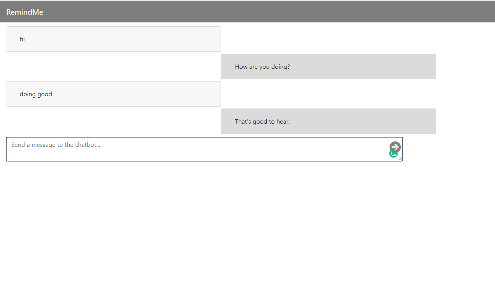

# django-chat Version 1.0

cwtsam's edits

Django Project with [ChatterBot](https://github.com/gunthercox/ChatterBot) as the chatbot. The frontend using VueJS.

Requirements saved in `req.txt`

> pip install -r req.txt

Once you have installed all, you can running the following command:

> python3 comedy/manage.py runserver

Once you have it running type message into textbox and it will return a message.

